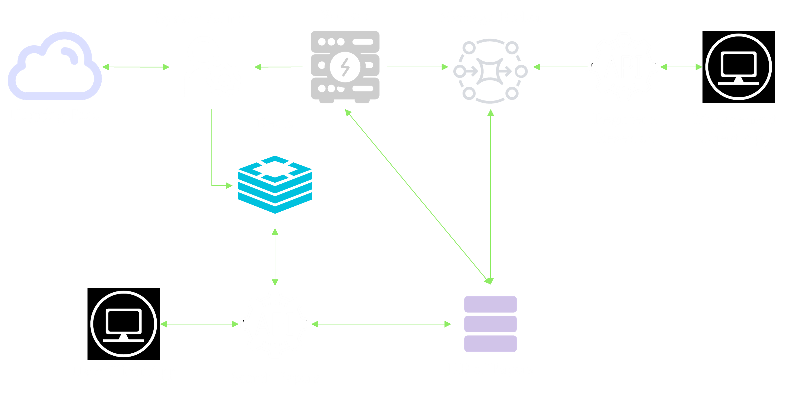

# 📚 Persian Research Paper Recommender System

A scalable **content-based recommender system** for Persian academic theses, designed to assist researchers in finding relevant scientific documents based on abstract similarity. This project was developed as part of a Bachelor's thesis at [Tehran Polytechnic (AUT)](https://aut.ac.ir/en) and focuses on leveraging **pretrained language models**, **vector similarity**, and a **microservice architecture** to deliver fast and relevant recommendations.

---

## 🧠 Project Overview

With the exponential growth in the number of academic publications, it has become increasingly difficult for researchers to manually discover similar and relevant research. This system addresses that challenge by automatically suggesting similar Persian theses based on the abstract provided.

- Extracts **semantic features** from thesis abstracts using state-of-the-art pretrained language models (e.g., **SBERT**).
- Computes **cosine similarity** between vectorized abstracts to identify related documents.
- Delivers results via a **REST API** and web frontend built using **React**.
- Designed for **scalability and maintainability** with a **microservice** and **containerized architecture** using Docker.

---

## ✨ Key Features

- 🔍 Content-based recommendations without needing user history  
- 🧾 Support for Persian language academic documents  
- ⚙️ Asynchronous task processing with Celery and Redis  
- 🧱 Modular architecture with Django microservices and PostgreSQL  
- 🌐 Frontend built using React  
- 📦 Fully containerized deployment with Docker  

---

## 📊 Tech Stack

| Layer                  | Technology                      |
|-----------------------|----------------------------------|
| Backend API           | Django, Django REST Framework    |
| NLP / Embedding       | Transformers |
| Database (RDBMS)      | PostgreSQL                       |
| Cache / Message Queue | Redis                            |
| Background Workers    | Celery                           |
| Frontend              | React (JavaScript)               |
| Containerization      | Docker                           |
| Deployment Architecture | Microservices                 |

---

## 🏗️ System Architecture

The system follows a scalable microservice architecture using containerized services for modularity and fault isolation.



---

## 🌐 User Interfaces & Endpoints

This platform provides **three user-facing interfaces**, each accessible through a different port when running locally:

### 1. 🧪 Swagger UI (`http://localhost:8000/api/docs/`)

- Interactive API documentation for developers
- Supports login, user registration, research paper creation, and other endpoints
- Only registered users can create/update/delete data

### 2. 👥 User Web App (`http://localhost:4000/`)

- Shows a list of the top 15 research papers on load (`/get/get_paper/`)
- Allows keyword search through titles
- Selecting a title sends a request to `/get/get_paper/{id}/` and returns:
  - Research details
  - A list of similar theses
- Fully navigable, showing details and related recommendations with each click

### 3. 🛠 Admin Panel (`http://localhost:5000/`)

- Login via `/api/user/token/` (JWT)
- Research entry form visible only to authenticated users
- Admins can:
  - Register users via `/api/user/create/`
  - Submit new papers via `/api/paper_creation/`
  - Trigger background tasks to recompute embeddings
  - Refresh Redis recommendation cache via GUI

⚠️ In real deployments, only system administrators should manage users (registration UI is only included for testing and demo purposes).

---
## 📁 Datasets Used

1. **Mohebbi et al. (1400) Dataset** – 3,047 manually curated Persian theses from Ganj (IranDoc).
2. **Ganj Extracted Dataset** – 31,831 Persian thesis abstracts scraped from the IranDoc system.

⚠️ **Note**: The datasets used in this project are **not publicly available** due to data ownership and privacy restrictions. They were provided solely for academic research purposes by the Ganj (IranDoc) platform and cannot be redistributed.
---

## 📈 Evaluation & Innovation

- Benchmarked multiple pretrained models; **SBERT** selected for best accuracy  
- Introduced a **hybrid evaluation metric** for threshold tuning  
- Designed a **production-ready, containerized platform**  
- Focused on **Persian-language document understanding and recommendation**

### 📊 Model Comparison Table
To evaluate models, we introduced two key concepts:

- **Alpha (α)**: The minimum cosine similarity required for a document to be considered a valid recommendation. Higher α leads to stricter filtering and typically fewer results.
- **HCP (Harmonic-Coverage Performance)**: A custom metric defined as the geometric mean of F1-score and coverage, balancing recommendation quality and quantity to better reflect user satisfaction.

The table below compares several pretrained models based on these and other common metrics.

| Model Name      | α    | Precision | Recall | F1     | Accuracy | Coverage | HCP   |
|-----------------|------|-----------|--------|--------|----------|----------|-------|
| **SBERT + Hazm**| 0.69 | 49.13     | 39.24  | **33.50** | 99.09    | 49.36    | **49.25** |
| SBERT           | 0.68 | 44.93     | 39.50  | 31.94  | 99.07    | 53.59    | 48.88 |
| ParsBert        | 0.87 | 42.29     | 38.61  | 29.03  | 98.92    | 48.57    | 45.22 |
| DistilBERT      | 0.86 | 41.39     | 38.26  | 31.12  | 98.82    | 34.82    | 37.82 |
| FastText        | 0.97 | 32.10     | 38.69  | 23.38  | 98.76    | 44.40    | 37.26 |
| RoBERTa         | 0.98 | **52.76** | 36.91  | 31.42  | 99.09    | 25.57    | 34.44 |
| mBART           | 0.97 | 41.74     | 36.62  | 33.03  | 99.00    | 28.88    | 34.14 |
| Word2Vec        | 0.99 | 23.85     | 37.97  | 20.04  | 98.83    | 56.55    | 33.55 |
| mT5             | 0.94 | 25.38     | **42.74** | 23.39  | 89.93    | 47.52    | 33.09 |
| byT5-base       | 0.94 | 25.38     | 42.74  | 23.39  | 89.93    | 47.52    | 33.09 |
| BERT            | 0.99 | 12.88     | 53.38  | 13.74  | 87.29    | 61.04    | 21.27 |
| GPT2-Persian    | 0.96 | 11.14     | 42.17  | 13.57  | 95.50    | 65.70    | 19.06 |
| GloVe           | 0.99 | 7.82      | 41.13  | 9.37   | 94.44    | **84.61** | 14.32 |
| byT5-Large      | 0.99 | 1.28      | 51.04  | 2.25   | 79.10    | 98.00    | 2.52  |


---

## 🚀 Getting Started

### Requirements

- Docker & Docker Compose  
- (Optional for dev) Python 3.9+, Node.js  

### Run the System Locally

```bash
docker-compose up --build
```

### Access Interfaces

- Swagger UI: [http://localhost:8000/api/docs/](http://localhost:8000/api/docs/)  
- User App: [http://localhost:4000/](http://localhost:4000/)  
- Admin App: [http://localhost:5000/](http://localhost:5000/)  

---

## 📌 Use Cases

- University libraries and institutional repositories  
- Academic search portals (e.g., IranDoc)  
- Recommendation systems for scientific Persian content  

---

## 📜 License

This project is intended for academic and research purposes.  
**Note**: Only the source code is shared publicly.  
Access to datasets must be requested separately from the data provider (IranDoc).

---

## 👤 Author

**Mahdi Mohammadi**  
Industrial Engineering & CS Minor – Tehran Polytechnic  
GitHub: [@MastersMasterM](https://github.com/MastersMasterM)
